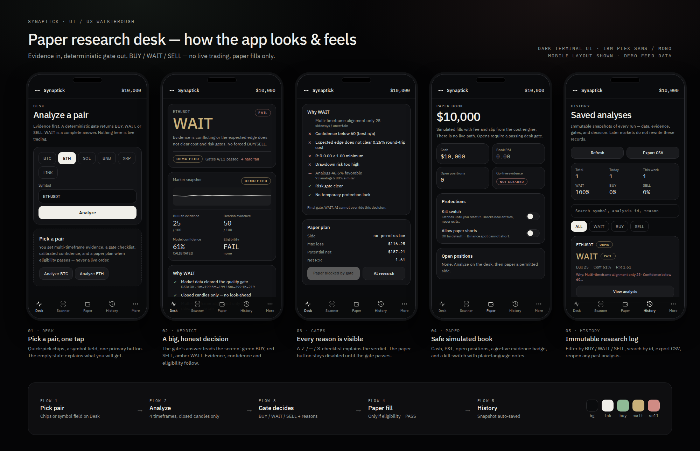

# Synaptick

**Paper research desk for crypto** — evidence in, deterministic gate out: **BUY / WAIT / SELL**.

AI may generate evidence. **AI never overrides the risk or trade gate.**
No live exchange path. Paper fills only.



## Stack

- TanStack Start + React 19, Vite, Tailwind CSS 4
- Zustand (local paper book / journal)
- PGLite (embedded) or Neon/Postgres (research history + paper journal)

## Requirements

- Node.js `^20.19.0` or `>=22.12.0`
- npm

## Quick start

```bash
git clone https://github.com/YOUR_USER/synaptick.git
cd synaptick
npm ci
npm run dev
```

Open <http://localhost:8080>. No configuration is needed: sign-in is off, and data lives in the
embedded PGLite database and your browser.

1. **Desk** → pick a pair → **Analyze**
2. Read **Why BUY/WAIT/SELL** and the gate checklist
3. If eligibility is **PASS**, optionally take a **Paper** fill
4. **History** keeps immutable analysis snapshots

Market data comes from Binance public klines. If they are unreachable the app falls back to a
clearly labelled **DEMO FEED** of synthetic candles, so it can never be mistaken for live tape.

## Configuration (optional)

Copy `.env.example` to `.env`:

| Variable | Purpose |
|----------|---------|
| `DATABASE_URL` | Neon / Postgres. Empty → embedded PGLite. |
| `XAI_API_KEY` | Enables the optional "AI research" panel (evidence only). |
| `VITE_AUTH_ENABLED` | `false` for local paper research (already set in `.grok/app-env.json`). |

## Scripts

| Command | What it does |
|---------|--------------|
| `npm run dev` | Dev server on port 8080 |
| `npm run build` | Production build + database migrations |
| `npm test` | Script tests + app-data/auth tests + Synaptick domain tests |
| `npm run typecheck` | TypeScript check |
| `npm run lint` | ESLint |
| `npm run check` | typecheck + lint + test |
| `npm run db:migrate` | Apply SQL migrations (needs `DATABASE_URL`) |

CI (`.github/workflows/ci.yml`) runs typecheck, lint, tests and a build on every push and PR.

## What's included

- Deterministic edge / R:R / cost / portfolio risk gate
- Strategy tournament + lab (paper research)
- Research memory (`analysis_id`, auto-save, History UI)
- Paper book with correct BUY/SELL cash accounting
- Dark terminal UI (Desk, Scanner, Lab, Tournament, Paper, History, Log), responsive with a
  bottom tab bar on mobile

## Migrations

- `0002_research_history.sql` — research runs + outcomes
- `0003_paper_trades_history.sql` — permanent paper journal
- `0004_drop_paper_trade_links.sql` — drops superseded table

The auth schema lives under `migrations/auth/` and is only promoted when sign-in is enabled.

## Platform note

Synaptick was built with Grok App Builder, and some of that platform glue is still in the repo
(`scripts/grok-pwa-*.mjs`, `server/middleware/grok-pwa.ts`, `public/__grok/`). It provides the
"Add to Home Screen" install page and manifest. It also injects the platform's
`grok.com/grok-app-builder/extensions.js` script into every HTML page. Remove
`grokPwaPlugin()` from `vite.config.ts` and delete `server/middleware/grok-pwa.ts` if you do not
want that third-party script in your own deployment.

## Safety

This is a **research / paper-trading** tool. Not investment advice. Not a live broker.

## License

No license has been chosen yet. Add a `LICENSE` file before accepting outside contributions.

## GitHub Pages + installable PWA

The repository includes a dedicated `Deploy Synaptick to GitHub Pages` workflow. It builds a static GitHub Pages artifact with the repository base path, copies the SPA entry point to `404.html` for client-side route fallback, and publishes it automatically from `main`.

After the first successful deployment, open **Settings → Pages** and use the **Visit site** link. GitHub Pages project URLs use the form `https://<username>.github.io/<repository>/`. On Android Chrome, open that URL and use **Install app** / **Add to Home screen**. The PWA manifest and service worker are included in the build.

GitHub Pages is a static host. The Pages build therefore uses the public Binance market REST API for market candles/tickers and the browser's IndexedDB for local research history. Server-only AI/database endpoints are not exposed in the Pages build, so secrets are not shipped to the browser. Paper trading remains local and simulated only.
